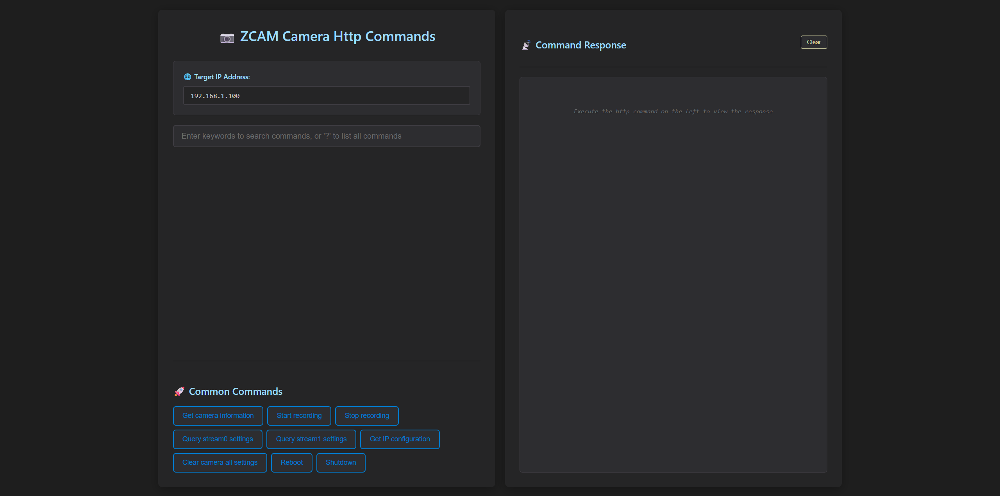
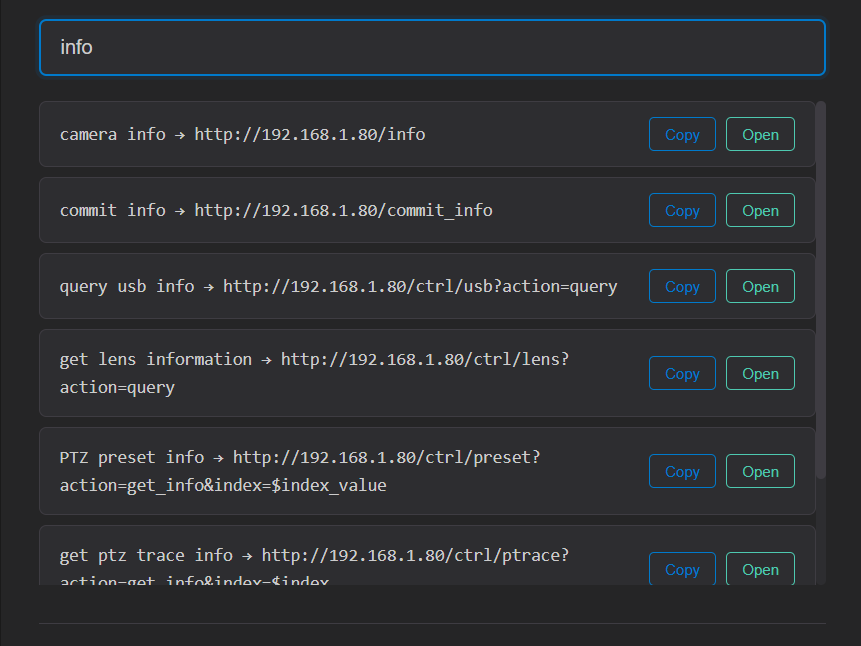
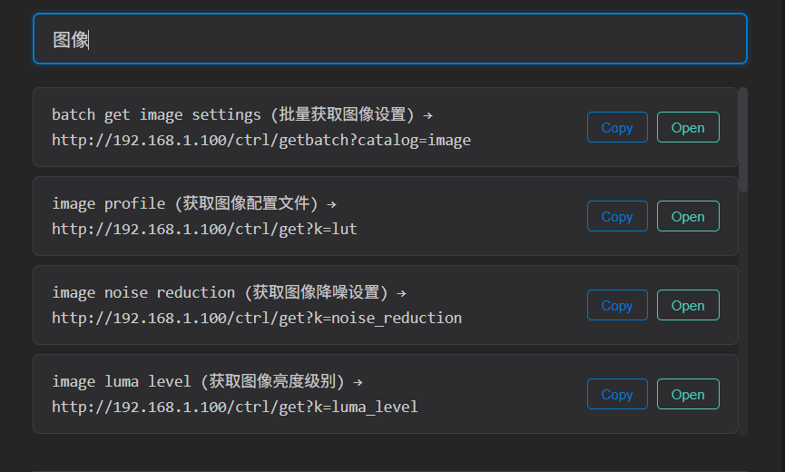
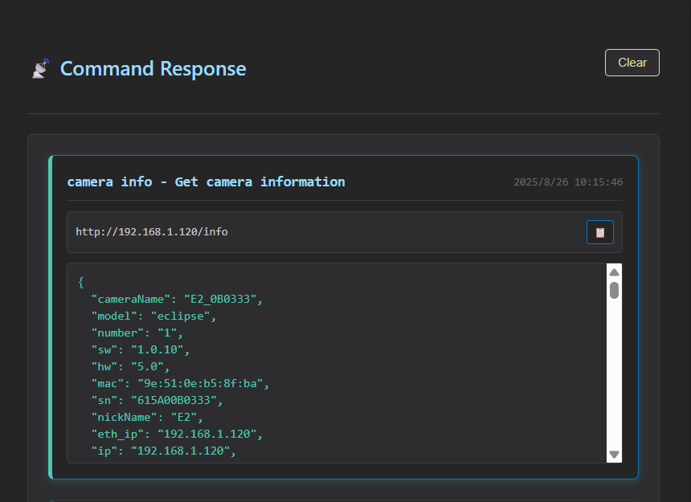
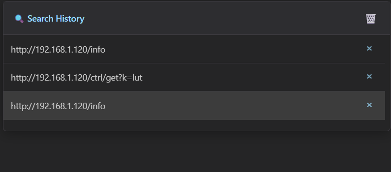
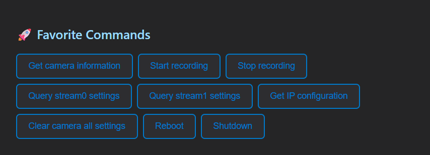

# ZCAM Camera HTTP Control Panel

[简体中文](./README_CHS.md)

A modern, responsive web-based control panel for ZCAM cameras, providing intuitive HTTP command execution and multi-language support.



This project is to facilitate the development of ZCAM cameras or developers who want to control the camera directly through http commands.

## 🌟 Features

- **Multi-language Support**: Automatic language detection (Chinese/English) with fallback to English
- **Smart Search**: Search commands by keywords or description in multiple languages
- **Command History**: Persistent search history with automatic IP address updates
- **Favorites Commands**: Quick access to commonly used commands
- **Real-time Execution**: Execute HTTP commands directly from the web interface
- **Dark Theme**: Modern Cursor-style dark theme for better user experience

## 🚀 Getting Started

### Prerequisites
- A ZCAM camera in Local network
- Modern web browser (Chrome, Edge)
- The camera IP address is configured correctly and can be accessed by your computer.
- Only tested on Windows 10/11

### Quick Start
1. Clone this repository to your local machine:
   ```bash
   git clone https://github.com/Jack-vexel-ws/zcamhttp
   cd zcamhttp
   ```
2. Open the `index.html` file in your web browser,for Windows platform, you can usually double-click this file to automatically open the default browser of the machine. 
3. Enter your camera's IP address in the IP input field
4. Start searching and executing commands!

## 📖 How to Use

### Enter Camera IP Address
- Locate the IP input field at the top of the interface
- Enter your ZCAM camera's IP address (e.g., 192.168.1.100)
- All command URLs will automatically update with the new input IP

### Searching Commands
- Type ? in the search box to list all supported commands

- Type keywords in the search box to find commands,Results show command name, description, and URL 
- Search works in both English and Chinese



### Executing Commands
- Click on any command from the search results, the command URL will automatically fill in the search box,the URL will be highlighted and ready for execution
- Press `ENTER` to execute the HTTP command
- View real-time response in the right panel,command responses are displayed with timestamps


### Using Command History
- **Automatic History**: Automatically save the last 10 http commands
- **Smart Updates**: History automatically updates when camera IP address changes
- **Quick Access**: Click on history items to re-execute commands
- **Management**: Clear individual items or entire history as needed


### Using Favorites
- **Pre-configured Commands**: Quickly obtain common http commands for accessing the camera
- **One-click Access**: Click the common command button to fill the common commands into the command search box, and press `Enter` to execute
- **Customizable**: Modify favorites list in the configuration file - `commands.js`


## IMPORTANT TIPS
When you get a command which has `$XXXX`, for example, `$key`, `$value`, it means this command have option parameters, you should fill correct parameters, a string or value in there, then exeucte your command.

### How to get the parameters type and range
> For most commands, if it is a set command like this `/ctrl/set?$key=$value`, then you can use its get command `/ctrl/get?k=$key` to get its type and range
(Please reference [ZCAM offical Http API document](https://github.com/imaginevision/Z-Camera-Doc/blob/master/E2/protocol/http/http.md#Camera-settings) to learn the data type and range)

### Examples 
`image brightness` command, execute `/ctrl/get?k=brightness` command to get its type and range, like this:

```
{
  "code": 0,
  "desc": "string",
  "key": "brightness",
  "type": 2,
  "ro": 0,
  "value": 50,
  "min": 0,
  "max": 100,
  "step": 1
}
```
its type is 2, it means it is a value type, have min and max range, you can send `/ctrl/set?brightness=50` to set image brightness to 50

`image profile` command, send `/ctrl/get?k=lut` to get its response like this:

```
{
  "code": 0,
  "desc": "string",
  "key": "lut",
  "type": 1,
  "ro": 0,
  "value": "Rec.709",
  "opts": [
    "Rec.709",
    "Z-Log2",
    "Flat",
    "HLG",
    "Vivid 0",
    "Vivid 1",
    "Vivid 2",
    "Concert",
    "Gamma"
  ],
  "all": [
    "Rec.709",
    "Z-Log2",
    "Flat",
    "Concert",
    "Vivid 0",
    "Vivid 1",
    "Vivid 2",
    "HLG",
    "Gamma"
  ]
}
```
Its type is 1, it has option values `Rec.709` `Z-log2` `HLG`...， you can send `/ctrl/set?lut=HLG` to set image profile to `HLG`.

## 🌐 Language Support

- The WEB interface automatically detects your browser language. Currently, only Chinese and English are supported. Unsupported languages ​​will automatically run in English.
- You can search using keywords in both `简体中文` and `English`.
- Search results will be displayed in the detected interface language.

## 🔧 Troubleshooting

- Ensure the camera's IP address is correctly configured and that your computer can access the camera.
- Some HTTP commands may not be supported on certain camera models.
- Some HTTP commands may require the camera's firmware to be up to date.

## 📱 Browser Compatibility

- **Chrome**: Full support (recommended)
- **Edge**: Full support
- **Firefox**: No test
- **Safari**: No test
- **Mobile Browsers**: No test

## 📞 Getting Help

If you encounter any issues:
1. Check the troubleshooting section above
2. Verify your camera's network connectivity
3. Ensure you're using a supported browser
4. Check [the ZCAM camera's HTTP offical API documentation](https://github.com/imaginevision/Z-Camera-Doc/blob/master/E2/protocol/http/http.md)

---

**Enjoy controlling your ZCAM camera with ease! 🎥**
