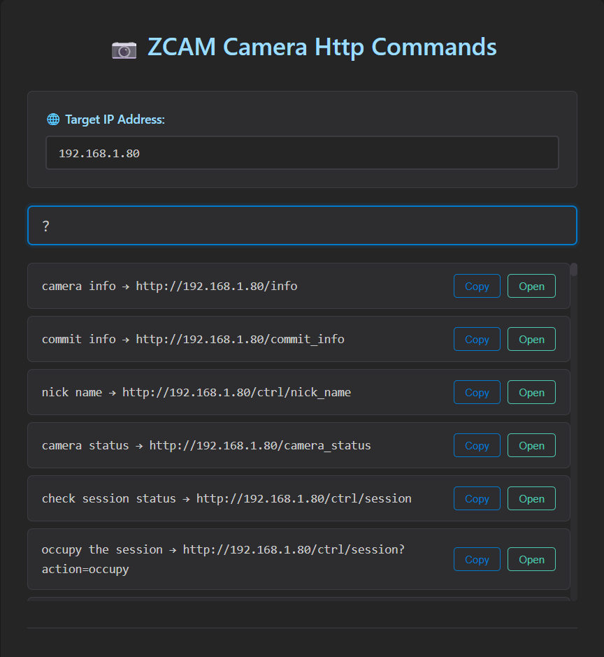
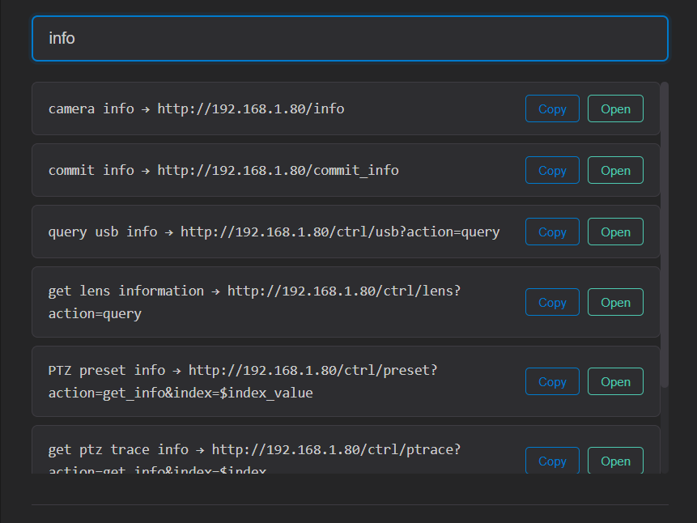
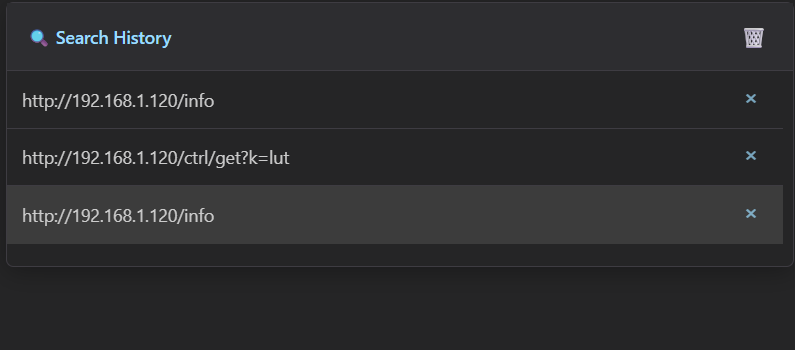

# ZCAM 相机 HTTP 控制面板

[English](./README.md)

一个现代化的、响应式的基于Web的ZCAM相机控制面板，提供直观的HTTP命令执行和多语言支持。


本项目旨在为ZCAM相机的开发或想要直接通过HTTP命令控制相机的开发者提供便利。

## 🌟 功能特点

- **多语言支持**: 自动语言检测（中文/英文），不支持的语言自动回退到英文
- **智能搜索**: 通过命令关键字或描述进行多语言搜索
- **命令历史**: 持久的搜索历史记录，IP地址变化时自动更新
- **常用命令**: 快速访问常用命令
- **实时执行**: 直接从Web界面执行HTTP命令
- **深色主题**: 现代化的Cursor风格深色主题，提供更好的用户体验

## 🚀 快速开始

### 前置要求
- 一台ZCAM相机连接在局域网中
- 现代Web浏览器（Chrome、Edge）
- 相机IP地址配置正确，计算机可访问
- 目前仅在Windows 10/11上测试过

### 快速开始
1. 将本仓库克隆到您的本地机器：
   ```bash
   git clone https://github.com/Jack-vexel-ws/zcamhttp
   cd zcamhttp
   ```
2. 在Web浏览器中打开 `index.html` 文件，在windows平台，通常你双击此文件即可自动打开本机默认浏览器
3. 在IP地址输入框中输入您的相机IP地址
4. 开始搜索和执行命令！

## 📖 使用方法

### 输入相机IP地址
- 在界面顶部找到IP地址输入框
- 输入您的ZCAM相机IP地址（例如：192.168.1.100）
- 所有命令URL将自动更新为新的输入IP

### 搜索命令
- 在搜索框中输入 ? 列出所有支持的命令

- 在搜索框中输入关键词查找命令, 结果显示命令名称、描述和URL
- 搜索支持英文和中文



### 执行命令
- 点击搜索结果中的任何命令,命令URL将自动填入搜索框,URL将被高亮并准备执行
- 按`回车`键执行HTTP命令
- 在右侧面板中查看实时响应,命令响应显示时间戳


### 使用命令历史
- **自动历史**: 自动保存最近访问的10个http命令
- **智能更新**: IP地址变化时历史命令记录会自动更新相机IP
- **快速访问**: 点击历史命令记录项重新执行命令
- **管理功能**: 根据需要清除单个记录或整个命令历史记录


### 使用常用命令
- **预配置命令**: 快速获取访问相机的常用http命令
- **一键访问**: 点击常用命令按钮即可将常用命令填充至命令搜索框内，按下`回车`即可执行
- **可自定义**: 在配置文件 `commands.js` 中修改常用命令列表


## 重要提示
当您获得包含 `$XXXX` 的命令时，例如 `$key`、`$value`，这意味着该命令有选项参数，您应该填写正确的参数，字符串或值，然后执行您的命令。

### 如何获取参数类型和范围
> 对于大多数命令，如果它是像这样的设置命令 `/ctrl/set?$key=$value`，那么您可以使用其获取命令 `/ctrl/get?k=$key` 来获取其类型和范围
（请参考 [ZCAM官方HTTP API文档](https://github.com/imaginevision/Z-Camera-Doc/blob/master/E2/protocol/http/http.md#Camera-settings) 了解数据类型和范围）

### 示例
`image brightness` 命令，执行 `/ctrl/get?k=brightness` 命令获取其类型和范围，像这样：

```
{
  "code": 0,
  "desc": "string",
  "key": "brightness",
  "type": 2,
  "ro": 0,
  "value": 50,
  "min": 0,
  "max": 100,
  "step": 1
}
```
其类型为2，这意味着它是值类型，有最小和最大范围，您可以发送 `/ctrl/set?brightness=50` 将图像亮度设置为50

`image profile` 命令，发送 `/ctrl/get?k=lut` 获取其响应，像这样：

```
{
  "code": 0,
  "desc": "string",
  "key": "lut",
  "type": 1,
  "ro": 0,
  "value": "Rec.709",
  "opts": [
    "Rec.709",
    "Z-Log2",
    "Flat",
    "HLG",
    "Vivid 0",
    "Vivid 1",
    "Vivid 2",
    "Concert",
    "Gamma"
  ],
  "all": [
    "Rec.709",
    "Z-Log2",
    "Flat",
    "Concert",
    "Vivid 0",
    "Vivid 1",
    "Vivid 2",
    "HLG",
    "Gamma"
  ]
}
```
其类型为1，它有选项值 `Rec.709`、`Z-log2`、`HLG`...，您可以发送 `/ctrl/set?lut=HLG` 将图像配置文件设置为 `HLG`。

## 🌐 语言支持

- WEB界面自动检测您的浏览器语言，目前仅支持简体中文和英文，未支持的语言均自动以英文运行
- 可以同时使用`简体中文`或`英文`关键词搜索命令
- 搜索结果会以检测到的界面语言来显示

## 🔧 故障排除

- 确保相机IP地址配置正确，您的计算机可以访问到此相机
- 某些http命令可能在某些型号的相机上不支持
- 某些http命令可能要求相机的固件版本为最新

## 📱 浏览器兼容性

- **Chrome**: 完全支持（推荐）
- **Edge**: 完全支持
- **Firefox**: 未测试
- **Safari**: 未测试
- **移动浏览器**: 未测试

## 📞 获取帮助

如果您遇到任何问题：
1. 检查上面的故障排除部分
3. 确保您使用的是支持的浏览器
4. 查看[ZCAM相机的HTTP官方API文档](https://github.com/imaginevision/Z-Camera-Doc/blob/master/E2/protocol/http/http.md)

---

**享受轻松控制您的ZCAM相机的乐趣！🎥**
